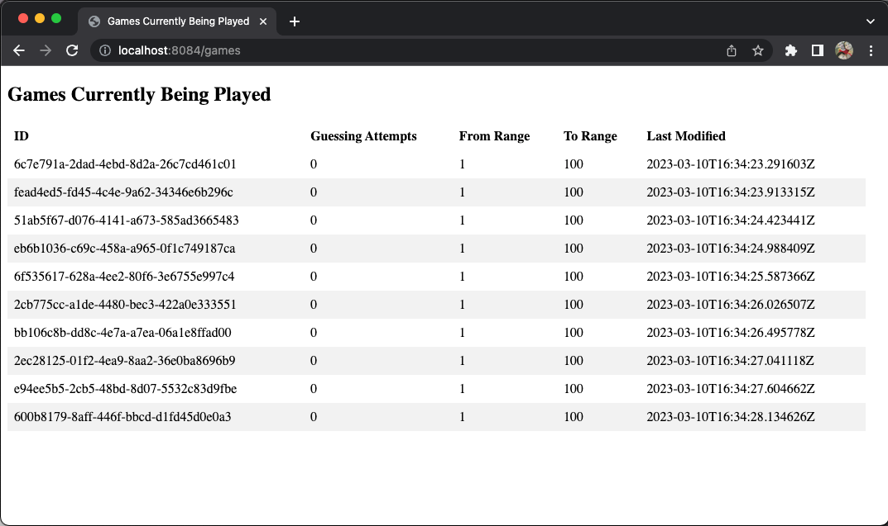

# Guessing Game MVC
This application demonstrates the principles of GaaS (Guessing-as-a-Service) using Spring MVC (Model View Controller).

The service works in tandem with the [Guessing Game API](https://github.com/shurvitz/guessing-game-api) to display an
active list of guessing-games currently being played in your Web browser with the aid of the
[index.html](https://github.com/shurvitz/guessing-game-mvc/blob/master/src/main/resources/static/index.html) form.

***Note***: Both this application and the **Guessing Game API** mentioned above need to be running simultaneously for
the HTML page to display correct information. To that end, this Spring application will be listening on
**localhost:8084** (port 8084).

# Initiating the MVC
1. Clone this repo and pull into your local machine.
2. `GuessingGameMvcApplication` (IntelliJ IDEA).
3. `mvn clean install` followed by `java -jar target/guessing-game-mvc-0.0.1-SNAPSHOT.jar` (terminal).
4. Open [index.html](http://localhost:8084/games) in browser.

All games currently being played will display in the Web page (see example blow).

